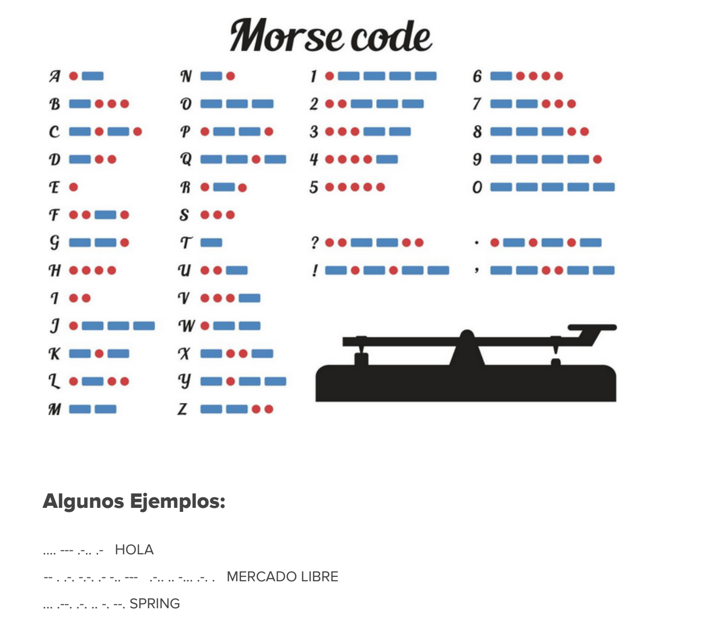

El Código Morse permite codificar cada caracter del abecedario como una secuencia de
"puntos" y "guiones". Por ejemplo, la letra A se codifica como · -, la letra Q se codifica como
−− · - y el dígito 1 se codifica como · −−−−.

El código Morse no distingue entre mayúsculas y minúsculas, sin embargo sus traducciones
tradicionalmente se muestran en letras mayúsculas. Cuando el mensaje está escrito en
código Morse, se usa un solo espacio para separar los códigos de caracteres y se usan 3
espacios para separar palabras.

1. Se solicita llevar a cabo un API que reciba un Codigo Morse y devuelva su
   traducción en español. Tener como referencia del significado de cada símbolo la
   siguiente tabla:

