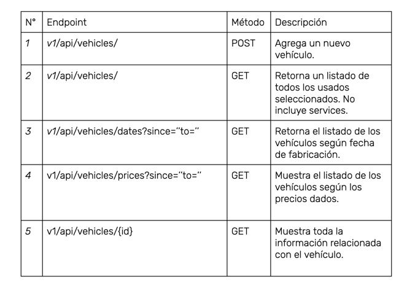
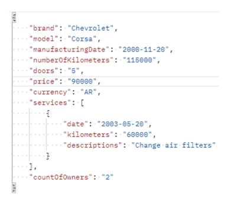

Una concesionaria de automóviles desea realizar un API REST que le permita realizar la carga de determinados autos usados. Para ello, necesitamos desarrollar los siguientes endpoints:

Dado que el dueño de la concesionaria es un cliente muy exigente, se sugiere realizar buenas prácticas de programación como por ejemplo la separación del proyecto según la Arquitectura Multicapas.
Tener en cuenta que por el momento, al no estar trabajando con bases de datos, podemos implementar collections (listas, arraylists, etc) para manejar los CRUD de manera lógica.

Por otro lado, un analista funcional nos proporciona el siguiente Payload de ejemplo para tener en cuenta a la hora de realizar un alta mediante el método POST:

