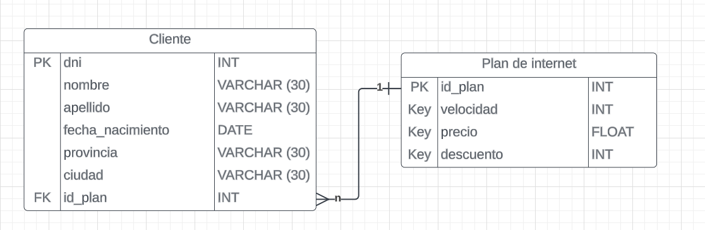

### Ejercicio 1

### Ejericio 2
1)Dni ya que identifica univocamente al registro
2)id_plan ya que identifica univocamente al registro
3)1 plan a muchos clientes, y un cliente tiene 1 plan. El FK va en la de muchos, es decir cliente. Hace referencia PK de plan	
